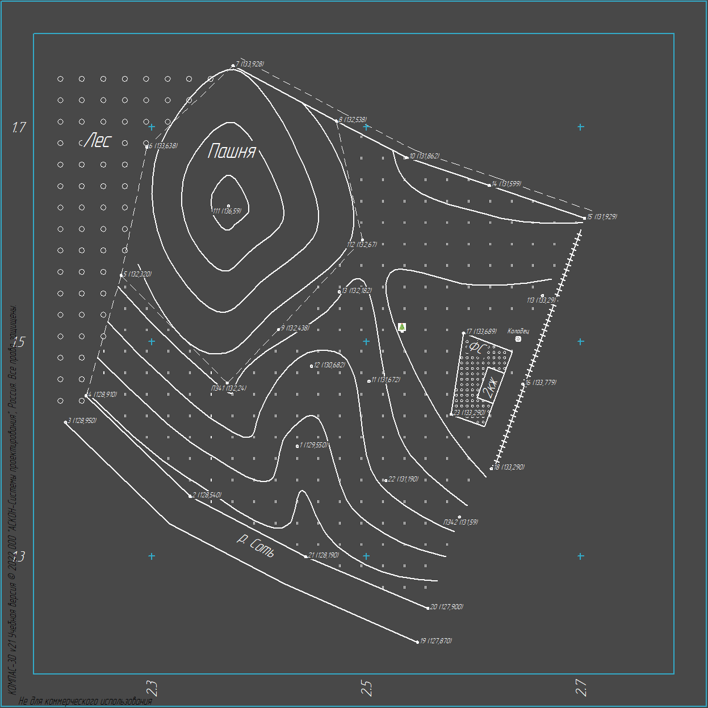

# 🌍 Геодезия в компасе 🧭

Эту "программу" я написал, чтобы автоматизировать моё университетское задание по геодезии в КОМПАС-3D v21. Я не знаю, как работать с api компаса (спасибо АСКОН за документацию, которой нет) и совершенно не пытался оптимизировать этот проект, здесь вы не увидите хорошего кода или человеческой структуры кода. 

## Функции

- Построение плана местности в КОМПАС-3D v21 по данным из таблицы `Геодезия.xlsm`.
- Построение продольного профиля на трассе по данным из таблицы `Геодезия.xlsm`.
- Супер таблица экселя с макросами для УМС, которая может посчитать все нужные данные по данным варианта.

## Как установить

1. Боже, зачем вам это нужно? Кем бы вы ни были, мне вас жаль. Я проверял работу скрипта только с 21 версией компаса на python 3.11.

2. Установите python и все импортируемые библиотеки (мне лень их писать)

3. [Установите pywin32 и скопируйте в свою версию библиотеки и api компаса](https://youtu.be/UVCH_wDlFNU?t=797)

4. Используйте jupyter notebooks из проекта
    
## Acknowledgements

 - [Ёлка](https://www.flaticon.com/free-icon/christmas-tree_347052)
